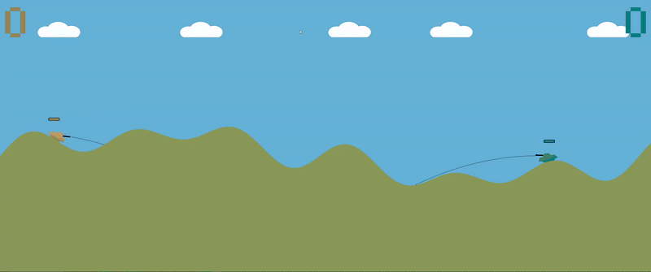

# Tank-Wars

## Press on the image to check a demo from youtube!

In this 2D tank combat game every element from the war machines to the very letters on the screen is constructed from triangular shapes, forged entirely from scratch in C++ and OpenGL.
With every sprite and model sculpted from simple triangles, including even the game’s topography, the visuals carry a raw, geometric charm that makes Tank Wars uniquely its own.

## Features 

### Terrain Deformation

The battlefield is ever changing. Not only does the terrain deform under the impact of tank shells, but it also smooths itself over time, preventing unnatural shapes from forming, which may hinder the tank's movement. This ensures a realistic and fluid battlefield evolution, where destruction is dynamic yet visually cohesive.

### Health System

Each tank has a simple yet effective health system taking direct hits from enemy projectiles reduces durability. Once a tank reaches a critical damage threshold, it won’t just look battle-worn; it will move sluggishly, struggling to traverse the battlefield.

### Score system

The game keeps track of each player's triumphs with a straight forward score system, counting every win, and displaying a flashy text announcing it.

